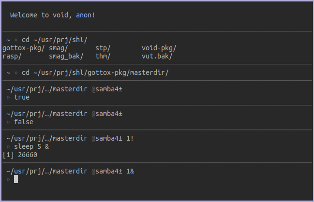
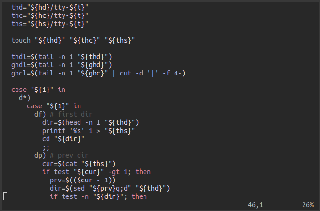

author: Anachron
tags: wm, shell, status, screen, editor, media, files, dirs 
title: Diving into the Void
published: 2018-08-24T12:00:00
template: post.tpl
issue: 3

---

# Diving into the Void

## The WM, StatusBar, Shell and Editor

### Window-Manager

After fiddling around with `i3wm`, `bspwm` and `wmutils` I've now come to my new favorite WM: `cwm`.

`cwm` is not only portable and very well written but also very fast. 
It allows you to use the mouse and keyboard for window moving/resizing/selecting and can be configured via a rc-file.

In my personal testing and daily working with the WM I've come to the conclusion that `cwm` is what I've always wanted.
`cwm` supports window groups, easy key binding, reloading via `HUP` signal and very fast execution whatever you command.

### Status-Bar

I've come to the conclusion that the less you clutter your statusbar with, the more productive you are. 
This concept you can also find in my `$SHELL`, `$EDITOR` and `$IRC` setups respectively.

For my statusbar I use `lemonbar`. I've written a ton of scripts to monitor important system events/statistics.
Whenever something urgent is up, my lemonbar will display a symbol on the desktop indicating something being urgent.
Normally when nothing is up my statusbar is empty.

The following screenshot includes both the information that my sound is muted and that I have an outgoing ssh session open.

### Shell

I'm still on `bash` but rewrote most of my scripts to be `posix` compatible.
`mksh` is my destination, will need a bit more testing though.

My `$SHELL`-prompt tries to be both minimal and functional. The prompt will show me:

* The current working directory (`$PWD`)
* The git branch and if it has any non-commited changes
* Return code of the last run command (`$?`), if not 0
* Amount of jobs in the background, if any
* Amount of .env-variables that are injected into the env, if any

When the prompt gets too long (>= 30 chars) the user input will be asked in a new line.

The following image contains a few examples of my shell prompt.

* The first prompt is minimal display
* The second prompt is minimal with truncated path (auto for long paths) + git status
* The third prompt shows how rc = 0 is being ignored
* The fourth prompt shows how rc > 0 are being displayed
* The fith prompt shows how to display background jobs active in current `tty`.

### Editor

My default `$EDITOR` is vim and I haven't customized it much. 
Since I am learning `rust` I have installed `RLS` (Rust Language Server) and that's it.

## IRC, Mail, Browsing and Gaming

*TODO*

## Media and Folders

*TODO*

# Screenshots/Workflow

Somewhat recent:

More up-to-date:

__Hint__: The themes are generated by wallpaper colors.
